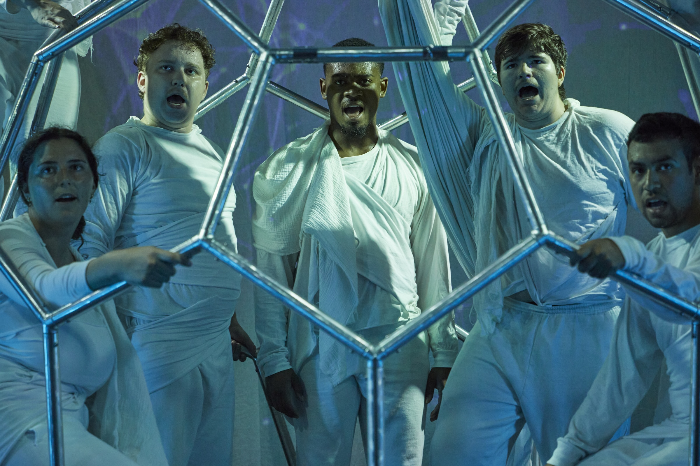

Press Release:

World premiere of physical theatre using an original bucky ball structure, dance, aerial, stage combat, and new music with songs.

LSU Physical Theatre Presents:

## [The Last Beginning](../)

When there is no one left but a handful of the human race, what keeps them going? Are we hardwired to self-destruct or can we find something that unites us all to survive and thrive? This production brings together dance, acrobatics, aerial silk, a new multi-person dance sphere, stage combat, original composition and innovative light-stick technology to create a new look at who we might become.

LSU Physical Theatre is committed to encouraging a view of global citizenry and cultural cross-pollination in the lives of young adults at home and abroad to foster a future of global inclusiveness and compassion. 

<aside class="pquote">
    <blockquote>
        
So much to feast your eyes on – prepare to be entertained and moved

    </blockquote>
    
Natasha Higdon – [Fringe Review 2024](https://fringereview.co.uk/review/edinburgh-fringe/2024/the-last-beginning/)

</aside>

LSU Theatre’s creative team consists of director, Nick Erickson, founding member of Diavolo: Architecture in Motion and a professional actor, director and choreographer of stage combat. Composer and Digital Media Artist, Jesse Allison, has been working in interactive video projection and responsive sound installations for over 20 years. Tyler Kieffer has 10 years of sound design in New York and beyond.  Author Vince LiCata has had several of his plays produced at the Fringe and in London. Olivia Lunsford, Chance Fillastre and Caitlin Church are debuting their professional compositions and songs with this production. Suzanne Chambliss has costume designed dozens of feature films and television shows in her career. 

----

Venue:  Greenside @ George Street  Lime Studio (Venue 236)

<aside class="pquote">
    <blockquote>
        
If you want to be amazed, terrified, and captivated. This show was unlike anything we had ever seen.

    </blockquote>
    
Byteback Theatre

</aside>

[Tickets: 15.00/10.00 August 2-10, 12-17, 19-24](https://tickets.edfringe.com/whats-on/last-beginning)

Time: 16:10 (40 Minutes)

Website:  [https://lsuphysicaltheatre.com](https://lsuphysicaltheatre.com)

Social Media: [Instagram](https://www.instagram.com/thelastbeginninglsu) (thelastbeginninglsu) and [Facebook](https://www.facebook.com/people/Lsuphysicaltheatre/61557618867910/) Lsuphysicaltheatre

For further information, images, or to request a media ticket, please contact Nick Erickson at nickwe@lsu.edu or 07938 806539

